# TrafficMatrix2013

Analysis and Development Document

| **Written by** | Hasan YILDIRIM ( SAP/NET Consultant) \@ **PIA** |
|----------------|-------------------------------------------------|
| **Email**      | HasanYildirim\@hotmail.com                      |
| **Place**      | Umraniye / İSTANBUL                             |
| **Date**       | 26.May.2014                                     |
| **Version**    | v1.0                                            |

## [1] Purpose of This Software :

This software will be providing the users the required tool to have AVEA PBN
Data Matrix and Analysis for all the different type of data available (Data,
Voice and Signalling).

There is 4 main requirement sited as bellow:

**I) Data Matrix**

This tool will be able to show the data matrix for all the current 24 location
at any specified time “new locations may be added or removed in the future and
this need should be addressed in this tool” in a different table format saurce
in Vertical and destination in Horizontal line depending on the data type. We
have 3 type of data, but 4 tables should be provided, one table for data, one
table for signalling, one table for Voice and one table for Critical which is
basicaly the summation of Signalling and Voice. An approximation example is
shown in the figure 1 bellow.

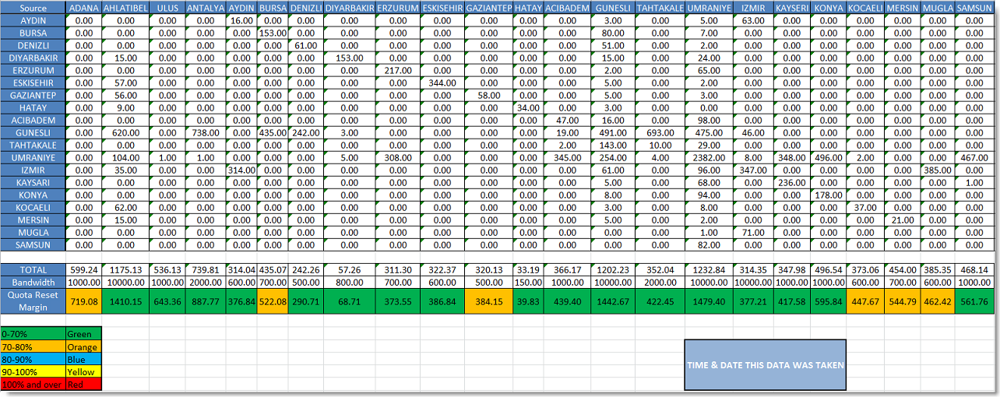

As seen in figure.1 toward the end of it, there is 3 new line and a colour table

a) Total: which is basically the total value received by one location without
from same to same location being calculated, example adana total value should
not include the value from adana-1 to adana-2 or vise-versa.

b) Bandwidth: This value is the maximum value that a traffic is allowed to pass
in a certain line, this should be flexible to the users to edit at anytime.

c) Quota Reset Margin: Is the result of (Total \* Index) ; The result will have
a Flexibe colour depend on the result value; for example if the result is
between 0 and 70% (as shown in the lower table in figure-1) of the Bandwidth the
cell will have a Green colour. The index and the percentage values should be
Flexible to the user to change if needed.

**II) Data Analysis**

This tool will have the ability to track and show’s in a graphical and numerical
value the data progress for any or all locations and type of data (critical and
data) for any different times “it could be 2 times or more while being the
oldest time specified as the reference to the progress”.

**III) Forcasting**

This tool will have the ability to Forecast the traffic value trend based on the
past values with the use of Moving Average Formula. Ft = (1/N) (Dt - 1 + Dt - 2
+ . . . + Dt - n )

Ft: The Forcasted value for the specific time; for our need it should be weekly
based

Dt: The Data value on a specific Time

N: number of sample we have used

For more understanding on this I have sited bellow in figure-2 an example:

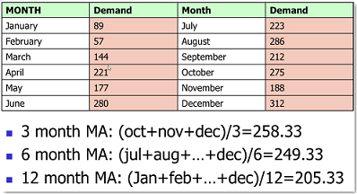

We can see a 3, 6 or 12 months forecast period based on the same previous period
of data in the past.

The End result that the Software should provide is not just w numerical value
for the next week, month, serveral months or year, but also it should be shown
in a graph that clearly shows the Current Value along with the expected future
values.

PS: the graph should also use the Colous meaning shown in figure-1 to emphasis
on wheather or not we will have to upgrade any certain link.

**IV) Sub-Region Analysis**

Basicaly the current 24 Location (48 PE router) will be divided into 4 different
Sub-region Group depending on the PE-P connection;

The 4 Group is cited in bellow:

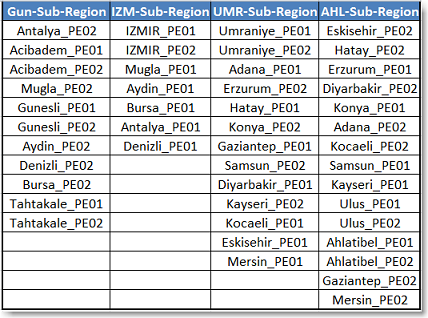

-   We should be able to do all the upper three requirement but in Sub-Region
    based and not just a location Based.

-   We should be able to add a threshold for this link that in case a value past
    this value; it will inform us.

**Database Requirement**

This Tool relies heavily on past data, in order to analyse or forcast, but
unfortunately since the storing the raw data for 3 years will require a huge
system and would coste a lot, a decision has been made to go with the condense
type of data and save for 1 year only for now.

## [2] Used Software Technologies and Methods :

        Devlopment IDE      : Microsoft Visual Studio 2012 Ultimate
        Development Lang    : Visual C# 4.0
        NET Framework       : Version 4.0
        ORM                 : MS Entity Framework v5.0
        Database            : ORACLE 11g Enterprise Edition
        Serial Comm.        : MS NET Framwork Library
        Visual Comps.       : DevExpress v12.2.8
        FTP Connectivity    : Rebex FTP v5.0.0

**Microsoft** software development technologies have been used to develop this
tool and ORACLE was stand for backend.

As thirt party tools, Devexpress .Net components have been used for graphicial
interface. It provides user to have easy to use interface especially on grids,
lists and reports.

**DevExpress** (Developer Express Inc) is a software development company founded
in 1998 with headquarters in Glendale, California. DevExpress initially started
producing UI Controls for Borland Delphi/C++Builder and ActiveX Controls for
Microsoft Visual Studio. Presently, DevExpress has products targeting developers
that use Delphi/C++Builder, Visual Studio and HTML5/JavaScript technologies.

To have FTP connectivity, Rebex FTP library has been used. It was a crucial
process accessing Alcatel FTP server and SAM server over FTP interface. This
tool was also very helpful clear code development and solid state
communication...

**Rebex**’s mission is to provide top quality components for .NET developers.
Rebex is creating and selling .NET components worldwide since 2002. They develop
software for .NET platform since the first public beta version of .NET was
released.

Rebex is located in Prague, Czech Republic. The company is also providing
software development and outsourcing services for system integrators in the
Czech Republic.

Since this is going to be 7/24 runnig service application, capturing huge data
from SAM servers, it pushes to have large scale database. That’s why we picked
ORACLE Enterpise Server to store captured data.

**ORACLE** Database (commonly referred to as Oracle RDBMS or simply as Oracle)
is an object-relational database management system produced and marketed by
Oracle Corporation.

## [3] Data Model :

**Microsoft Entity Framework** used for data operations with LINQ language.
Developing single data access layer makes application easy to manage and clear
coding. It also provides strong security over db objects…

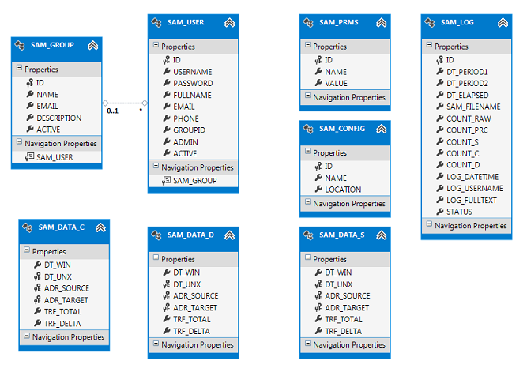

Entity Framework (EF) is an open source object-relational mapping (ORM)
framework for ADO.NET, part of .NET Framework. The Entity Framework is a set of
technologies in ADO.NET that support the development of data-oriented software
applications. Architects and developers of data-oriented applications have
struggled with the need to achieve two very different objectives. They must
model the entities, relationships, and logic of the business problems they are
solving, and they must also work with the data engines used to store and
retrieve the data.

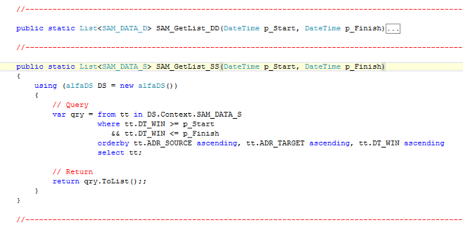

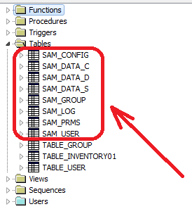

We can see application’s tables as above schema. If need to know what are the
important db objects in the platform:

-   **SAM_CONFIG :** Keeps all the network device names with location detail.
-   **SAM_DATA_C :** Stores traffic data for Critical type. It includes Signalling and Voice.
-   **SAM_DATA_D :** Stores traffic data for Data type mainly for internet packages.
-   **SAM_DATA_S :** Stores traffic data for Signalling.
-   **SAM_USER :** Stores application user names and passwords.
-   **SAM_GROUP :** Stores user’s group definitions and details.
-   **SAM_LOG :** Stores all runnig and finished process logs.
-   **SAM_PRMS :** Stores important server addresses, system username and passwords.

## [4] Application Interface :

The application consists of 5 main secreens as follow:

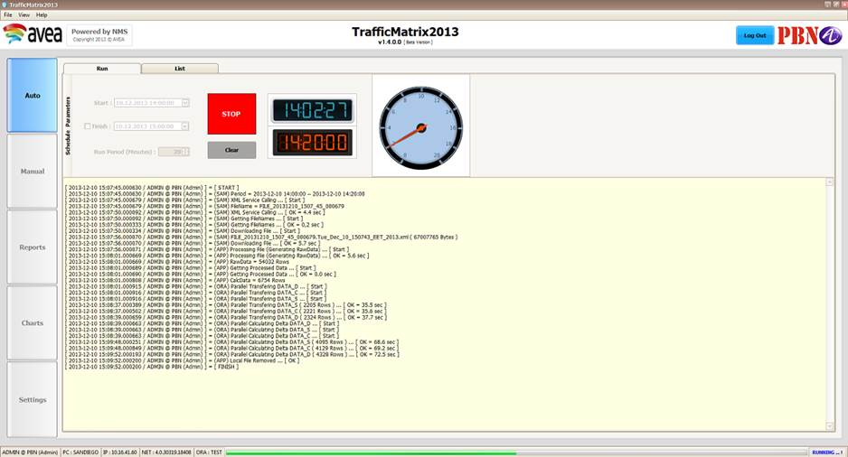

**Auto :** This screen shows auto process including log and details. Auto screen
provides strong scheduling mechanism to user. User can deside start and end
points for running process.

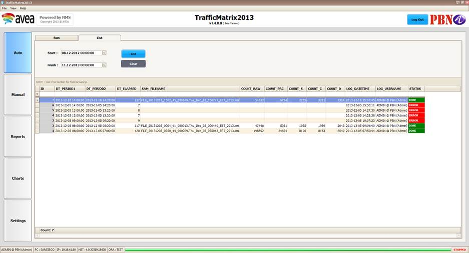

**Manual :** This part is mainly does same job with Auto except all steps fires
manually. This is a good to test it out new process and find bugs in the process
schedule.

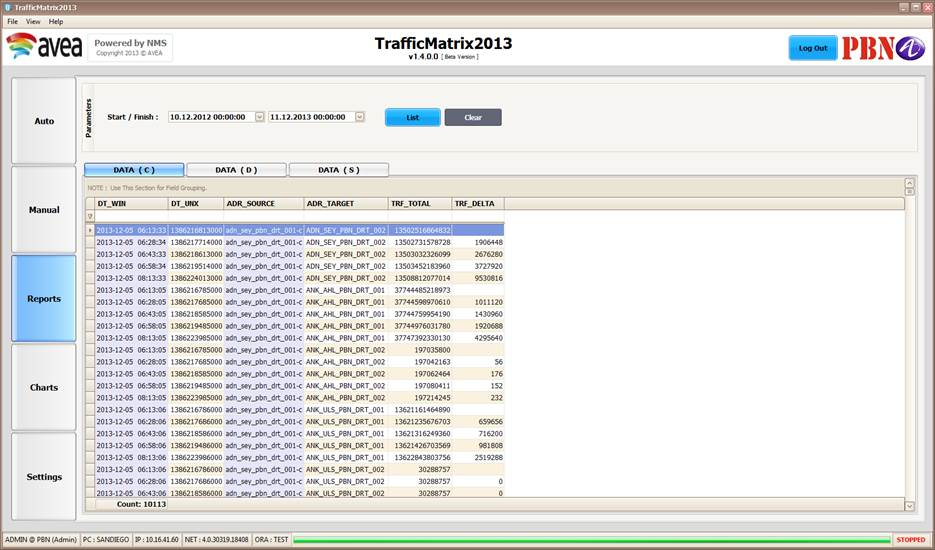

**Reports :** Shows results of runnig processes. User can filter for different periods.

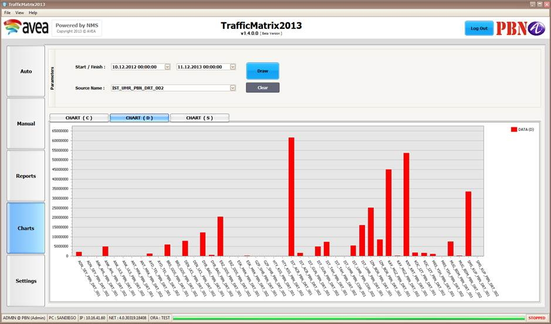

**Charts:** Displays graphical version of result numbers. It is good view to
compare different results. This screen is also have datetime selection. Each
results displayed DATA_C, DATA_D and DATA_S.

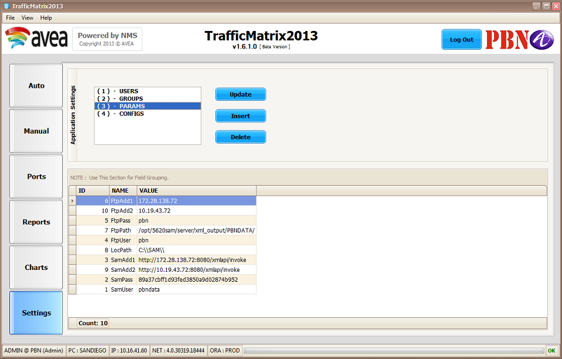

**Settings :** All the applications settings including server IP addresses,
system username and password both SAM and FTP stay here… User can easiy find
parameters here. In case if it is needed, this is the one place to update values.

Update and New Record Window:

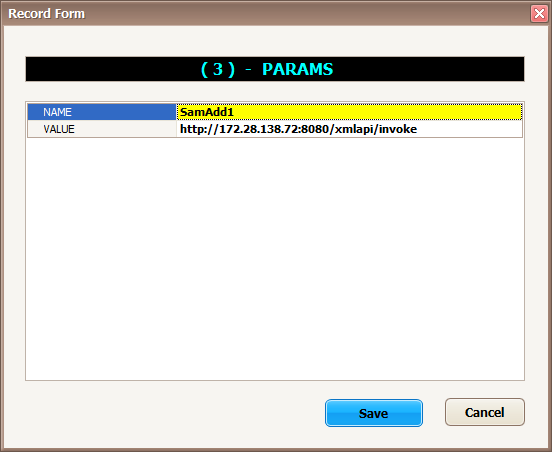

## [5] Delta Values:

To calculate delta values, the following formule was used:

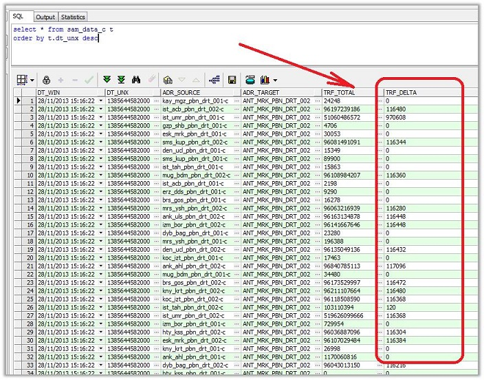

**Delta Formula =  [ ( Curr. Total - Prev. Total ) / ( Curr.DateTime - Prev.DateTime  ) ] \* 8**

**Color Coding For Running Processes  ( Error / Done / Running**

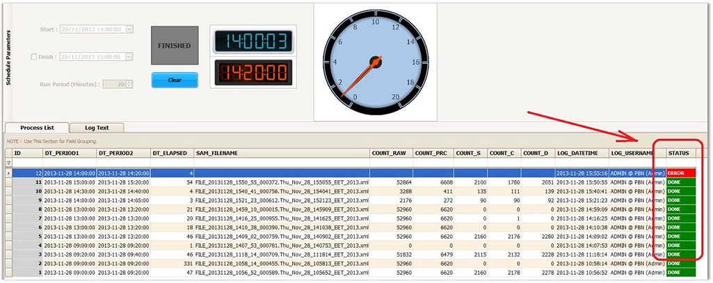

## [6] System Messages:

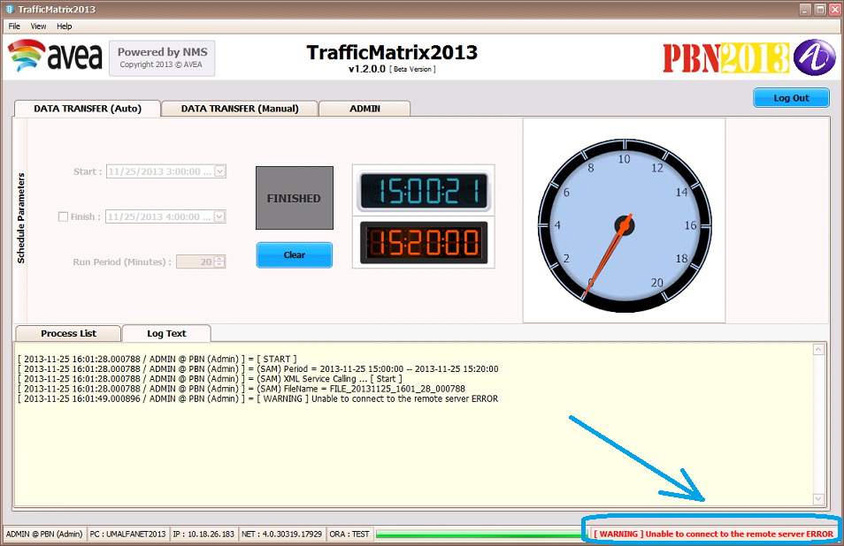

## [7] Application Setup :

**http://10.18.26.183/TrafficMatrix2013/Setup.htm**

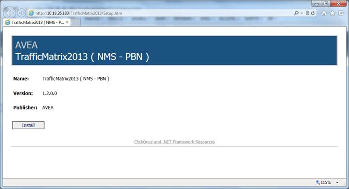

## [8] Application Key Features :

Here is the key feature list of the application:

-   **Call SAM Server and generate Output XML ( Result File )**
-   **Download result XML file to PBN system**
-   **Process File and convert to DataTable ( Raw Data - has everything )**
-   **Calculate and summarize raw table with grouping and generate processed data ( 8 Forwarding Class Single Source )**
-   **Transfer processed data to Oracle Table ( avoid double inserts )**
-   **Keep all statistics in a log table**
-   **Develop a Schedule Engine to have automated run system**
-   **Move all cruial settings into parameter table to make configurition friendly**
